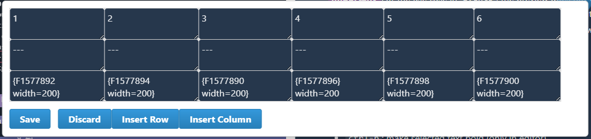

# Phabricator Remarkup Editor Plugin

This is a simple plugin that adds a button to the Phabricator Remarkup editor that allows you to edit the raw Remarkup text in full-screen mode.

## Security
- No additional package is required.
- Only inject CSS and JavaScript code into the current page.
- Volatile, the code will be removed after you refresh the page.
- No data is collected or sent to any server.

## Usage
- **!! Important !!** Currently, only `Task Maniphest`, `Events`, `Comment Editor`, and `New Comment` are supported.
- **!! Important !!** For the use case in `New Comment`, you need to type some text in the editor to show the preview panel before you can use the full-screen editor mode.
- **!! Important !!** For the use case in `Events`, the preview does not update automatically when you type in the editor. You need to re-open the full-screen editor mode to see the updated preview.

## Features
- Half screen mode
- Hot key for 
    - `ctrl-b`: make selected text bold (only in editor)
    - `ctrl-i`: make selected text italic (only in editor)
    - `: add a code block (only in editor) 
    - `Tab`: add 2 spaces to the beginning of each selected line (only in editor)
- Find and replace toolbox, including
    - Case sensitive / insensitive
    - Match whole world
    - Replace one / all
- Table Editor
    - After selecting a table, which can be a partial table or a full table, click the "Table Editor" button to edit the table in a new window.
    - 
- Auto-indention while breaking lines
- Clone Button for events and tasks. Make a clone from an existing one!

## Install on Your Bookmark
<!-- Set the bookmark row to visible -->
1. First, you need to make the bookmark row of your browser visible. In Chrome, you can do this by clicking the three-dot icon at the top right corner, selecting "Bookmarks" (書籤), and then selecting "Show bookmarks bar" (顯示書籤列).
2. Right-click on the space of the bookmark bar. Click "Add page" (新增網頁). Copy the following code: 
        ```
        javascript:(()=>{if(null!==document.getElementById("editor-enter-btn"))return void alert("The editor is already enabled!");function e(e){const t=document.querySelectorAll("div.fa-eye").length;var n=document.querySelectorAll("div.fa-eye")[t-1].parentElement;return null==n?null:(e!=n.classList.contains("preview-active")&&n.click(),n)}(()=>{const e=function(e){const t=e.match(/\d+/g);return Math.round((299*parseInt(t[0])+587*parseInt(t[1])+114*parseInt(t[2]))/1e3)>155}(getComputedStyle(document.body).backgroundColor)?"light":"dark";var t=`:root {--lt-color-background-darkmode: #1B2430;--lt-color-background-light: #FEFEFE;--lt-color-text-primary: var(${"light"===e?"--lt-color-text-dark":"--lt-color-white"});--lt-color-background-primary: var(${"light"===e?"--lt-color-background-light":"--lt-color-background-darkmode"});--lt-color-heading-1: ${"light"===e?"#B5C0D0":"#E2BBE9"};--lt-color-heading-2: ${"light"===e?"#CCD3CA":"#9B86BD"};--lt-color-heading-3: ${"light"===e?"#F5E8DD":"#7776B3"};--lt-color-heading-4: ${"light"===e?"#EED3D9":"#5A639C"};--lt-color-bullet: ${"light"===e?"#B1AFFF":"#50727B"};--lt-color-number: ${"light"===e?"#BBE9FF":"#78A083"};--lt-color-border: ${"light"===e?"#1679AB":"#B25068"};--lt-color-rect: ${"light"===e?"#ecdff1":"#622f78"};}`,n=document.createElement("style");n.innerText=t,document.head.appendChild(n)})(),(p=document.createElement("style")).innerText='.editor-height-full {height: 100vh !important;}.editor-height-half {height: 50vh !important;}.editor-left-col {display: block;position: fixed;z-index: 14;left: 0;bottom: 0;width: 50%;height: 100vh;}   .editor-left-col textarea {position: absolute;display: block !important;height: 100% !important;z-index: 14;background-color: transparent !important;padding-bottom: 80px;}.force-textarea-background {background-color: var(--lt-color-background-primary);}.editor-right-col {display: block;position: fixed;z-index: 14;left: 50%;bottom: 0;width: 50%;overflow-y: scroll;background-color: var(--lt-color-background-primary);}.editor-btn {z-index: 20;position: fixed;padding: 0;width: 50px;height: 50px;border-radius: 50%;opacity: 0.7;}.editor-btn p {text-align: center;}#editor-enter-btn {right: 50px;top: 50px;}#editor-size-btn {right: 120px;top: 50px;}#clone-btn {right: 190px;top: 50px;}.editor-move-down {position: fixed;bottom: 0;}a.phabricator-remarkup-embed-image img {  background-color: white;}.back-drop {position: absolute;z-index: 13;overflow: auto;width: 100%;height: 100%;padding: 4px 6px;box-sizing: border-box;border: 1px solid #A1A6B0;background-color: var(--lt-color-background-primary);padding-bottom: 80px;}.highlights {  white-space: pre-wrap;  word-wrap: break-word;  color: transparent;}marker {  color: transparent;}marker.bold {  font-weight: bold;  color: var(--lt-color-text-primary);}marker.long-bar::after {  content: "";  width: 100%;  position: absolute;  left: 0px;}marker.heading-1::after {  height: 26px;  background: var(--lt-color-heading-1);}marker.heading-2::after {  height: 18px;  background: var(--lt-color-heading-2);}marker.heading-3::after {  height: 10px;  background: var(--lt-color-heading-3);}  marker.heading-4::after {  height: 10px;  background: var(--lt-color-heading-4);}marker.circle::after {  content: "";  position: absolute;  margin-left: -1.5em;  width: 1.5em;  height: 1.5em;  border-radius: 50%;}marker.rect {  background-color: var(--lt-color-rect);}marker.dash::after {  content: "";  position: absolute;  margin-top: 0.5em;  margin-left: -1.5em;  width: 1em;  height: 0.5em;  border-radius: 20%;}marker.bullet::after {  background-color: var(--lt-color-bullet);}marker.number {  border-top-right-radius: 50%;  border-bottom-right-radius: 50%;  background-color: var(--lt-color-number);}marker.border {  background-color: transparent;  box-shadow: var(--lt-color-border) 0px 0px 1px 1px;}',document.head.appendChild(p);class t{static None=new t("None");static Normal=new t("Normal");static Task=new t("Task");static Event=new t("Event");static BlockEditor=new t("BlockEditor");static NewComment=new t("NewComment");constructor(e){this.name=e}}class n{static Full=new n("Full","editor-height-full");static Half=new n("Half","editor-height-half");constructor(e,t){this.name=e,this.style_name=t}}function r(){var e=document.getElementsByClassName("remarkup-assist-bar");const n=e.length>1?t.BlockEditor:t.Normal;var r=e[e.length-1].parentElement;return r.querySelector("textarea").focus(),[n,r]}function o(n){if(n.name===t.Normal.name){if(document.getElementsByClassName("phui-comment-preview-view").length>0)return document.getElementsByClassName("phui-comment-preview-view")[0].querySelector("div.phui-timeline-view");if(document.getElementsByClassName("phui-remarkup-preview").length>0)return document.getElementsByClassName("phui-remarkup-preview")[0]}return null!==e(!0)&&document.getElementsByClassName("remarkup-inline-preview").length>0?document.getElementsByClassName("remarkup-inline-preview")[0]:null}function a(e){var t=document.getElementsByClassName("jx-mask")[0],n=document.getElementsByClassName("jx-client-dialog")[0];e?(t.style.display="none",n.classList.add("editor-move-down")):(t.style.display="block",n.classList.remove("editor-move-down"))}var i="normal",l=n.Full,d=document.createElement("button");d.setAttribute("id","editor-enter-btn"),d.classList.add("editor-btn"),d.innerHTML='<p id="editor-text">Edit</p>',d.onclick=n=>{var[d,c]=r(),s=o(d);if(null!==c&&null!==s)if("normal"===i){i="editor",c.classList.add("editor-left-col"),c.classList.add(l.style_name),c.classList.remove("remarkup-preview-active"),s.classList.add("editor-right-col"),s.classList.add(l.style_name),document.getElementById("editor-text").innerText="Back",d===t.BlockEditor&&a(!0),(h=(u=c.querySelector("textarea")).parentElement.insertBefore(document.createElement("div"),u)).classList.add("back-drop"),h.setAttribute("id","back-drop");var p=u.getAttribute("class");if(!0===p.includes("PhabricatorMonospaced")){var m=p.includes("PhabricatorMonospaced")?"PhabricatorMonospaced":"";h.innerHTML=`<div id="div-highlights" class="highlights ${m}"></div>`,u.addEventListener("input",(e=>{var t=(e=>e.replace(/\n$/g,"\n\n").replace(/^#{1}(?!#).*$/gm,(function(e,t){return'<marker class="bold long-bar heading-1">'+e+"</marker>"})).replace(/^#{2}(?!#).*$/gm,(function(e,t){return'<marker class="bold long-bar heading-2">'+e+"</marker>"})).replace(/^#{3}(?!#).*$/gm,(function(e,t){return'<marker class="bold long-bar heading-3">'+e+"</marker>"})).replace(/^#{4}(?!#).*$/gm,(function(e,t){return'<marker class="bold long-bar heading-4">'+e+"</marker>"})).replace(/^={5}(?!#).*$/gm,(function(e,t){return'<marker class="bold long-bar heading-3">'+e+"</marker>"})).replace(/^={6}(?!#).*$/gm,(function(e,t){return'<marker class="bold long-bar heading-4">'+e+"</marker>"})).replace(/\*\*.*?\*\*/gm,(function(e,t){return'<marker class="bold">'+e+"</marker>"})).replace(/^(\s*(\-|\+)\s)/gm,(function(e,t){return'<marker class="dash bullet">'+e+"</marker>"})).replace(/\W(\d+\.\s)/gm,(function(e,t){return'<marker class="number">'+e+"</marker>"})).replace(/\{.*?\}/g,(function(e,t){return'<marker class="border parantheless">'+e+"</marker>"})).replace(/\[.*?\]/g,(function(e,t){return'<marker class="border parantheless">'+e+"</marker>"})).replace(/!!.*!!/gm,(function(e,t){return'<marker class="rect">'+e+"</marker>"})))(e.target.value);e.target.parentElement.querySelector("#div-highlights").innerHTML=t})),u.dispatchEvent(new Event("input")),u.addEventListener("scroll",(e=>{var t=e.target.scrollTop;e.target.parentElement.getElementsByClassName("back-drop")[0].scrollTop=t}))}else u.parentElement.classList.add("force-textarea-background")}else{var u;i="normal",(u=c.querySelector("textarea")).parentElement.classList.remove("force-textarea-background"),c.classList.remove("editor-left-col"),c.classList.remove(l.style_name),s.classList.remove("editor-right-col"),s.classList.remove(l.style_name),document.getElementById("editor-text").innerText="Edit",e(!1),d===t.BlockEditor&&a(!1);var h=c.querySelector("#back-drop");c.removeChild(h)}else alert("Current page does not support editor mode!")};var c=document.createElement("button");c.setAttribute("id","editor-size-btn"),c.classList.add("editor-btn"),c.innerHTML='<p id="editor-size-text">Half<br>Size</p>',c.onclick=e=>{var[t,a]=r(),i=o(t);a.classList.remove(l.style_name),i.classList.remove(l.style_name),l=l===n.Full?n.Half:n.Full,c.innerText=l.name,a.classList.add(l.style_name),i.classList.add(l.style_name)},document.body.appendChild(d),document.body.appendChild(c),(()=>{const e=document.createElement("div");e.innerHTML='<div id="find-replace-box" class="find-replace-box"><div><input type="text" id="find-input" class="find-input" placeholder="Find"><div id="span-num-text-found"></div><div title="Case sensitive"><span>|Aa|</span><label class="switch"><input id="capital-switch" type="checkbox"><span class="slider round"></span></label></div><div title="Match whole word"><span>[Aa]</span><label class="switch"><input id="whole-word-switch" type="checkbox"><span class="slider round"></span></label></div><button id="find-btn" class="find-btn">Find</button></div><div><input type="text" id="replace-input" class="replace-input" placeholder="Replace"><div title="Replace All"><span>All</span><label class="switch"><input id="match-all-switch" type="checkbox"><span class="slider round"></span></label></div><button id="replace-btn" class="replace-btn">Replace</button></div></div>',document.body.appendChild(e);const t=document.createElement("style");t.innerText='.find-replace-box {position: fixed;z-index: 100;bottom: 0;left: 0;padding: 1px;background-color: var(--lt-color-background-primary);border: 1px solid #ccc;border-radius: 5px;}.find-replace-box div {display: inline-block;position: relative;margin-left: 3px;margin-right: 3px;}.find-replace-box > div {padding-left: 10px;padding-right: 10px;}.find-input, .replace-input {padding: 1px !important;height: 20px !important;}.find-btn, .replace-btn {padding: 1px;}.switch {position: relative;display: inline-block;width: 32px;height: 18px;}.switch input { opacity: 0;width: 0;height: 0;}.slider {position: absolute;cursor: pointer;top: 0;left: 0;right: 0;bottom: 0;background-color: #ccc;-webkit-transition: .4s;transition: .4s;}.slider:before {position: absolute;content: "";height: 10px;width: 10px;left: 4px;bottom: 4px;background-color: white;-webkit-transition: .4s;transition: .4s;}input:checked + .slider {background-color: #2196F3;}input:focus + .slider {box-shadow: 0 0 1px #2196F3;}input:checked + .slider:before {-webkit-transform: translateX(13px);-ms-transform: translateX(13px);transform: translateX(13px);}.slider.round {border-radius: 17px;}.slider.round:before {border-radius: 50%;}',document.head.appendChild(t);const n=document.getElementById("find-btn"),o=document.getElementById("replace-btn");function a(e){const t=document.getElementById("capital-switch").checked,n=document.getElementById("whole-word-switch").checked,r=t?"g":"gi";return e=e.replace(/[-\/\\^$*+?.()|[\]{}]/g,"\\$&"),new RegExp(n?`\\b${e}\\b`:e,r)}n.onclick=()=>{var e=r()[1].querySelector("textarea");const t=document.getElementById("find-input").value,n=e.value;var o=a(t);const i=((n||"").match(o)||[]).length;if(0!==i)do{var l=e.selectionEnd,d=n.substring(l),c=((d||"").match(o)||[]).length;if(0===c&&i>0)e.setSelectionRange(0,0),d=n,l=0;else{const n=d.search(o)+l;e.setSelectionRange(n,n+t.length),document.getElementById("span-num-text-found").innerText=`${i-c+1} / ${i}`}}while(0===c&&i>0);else document.getElementById("span-num-text-found").innerText="0 / 0"},document.getElementById("find-input").addEventListener("keydown",(e=>{"Enter"===e.key&&(e.preventDefault(),document.getElementById("find-btn").click())})),o.onclick=()=>{var e=r()[1].querySelector("textarea");const t=document.getElementById("find-input").value,n=document.getElementById("replace-input").value,o=document.getElementById("match-all-switch").checked;var i=a(t);const l=e.value;if(i.test(l))if(o)e.value=l.replace(i,n);else{const r=l.search(i);e.setRangeText(n,r,r+t.length,"select")}}})();const s=(e,t)=>{e.selectionStart;const n=e.selectionStart,r=e.selectionEnd,o=t+e.value.substring(n,r)+t;e.setRangeText(o,n,r,"select")};var p;window.addEventListener("keydown",(e=>{if("textarea"==document.activeElement.type){let i=document.activeElement;if(e.ctrlKey&&"b"===e.key)s(i,"**"),i.setSelectionRange(i.selectionEnd-2,i.selectionEnd-2),e.preventDefault();else if(e.ctrlKey&&"i"==e.key)s(i,"//"),i.setSelectionRange(i.selectionEnd-2,i.selectionEnd-2),e.preventDefault();else if(e.ctrlKey&&"f"==e.key);else if("`"==e.key)s(i,"`"),i.setSelectionRange(i.selectionEnd-1,i.selectionEnd-1),e.preventDefault();else if("Tab"==e.key){for(var t=i.selectionStart;t>0&&"\n"!=i.value[t-1];)t--;for(var n=i.selectionEnd;n<i.value.length&&"\n"!=i.value[n]&&"\n"!=i.value[n+1];)n++;const r=i.value.substring(t,n).split("\n").map((t=>e.shiftKey?t.replace(/^  /,""):"  "+t)).join("\n");i.setRangeText(r,t,n,"select"),e.preventDefault()}else if("Enter"==e.key){for(e.preventDefault(),t=i.selectionStart;t>0&&"\n"!=i.value[t-1];)t--;var r=i.value.substring(t,i.selectionStart).match(/^\s*[-+]*(\d+\.)*\s*/m);if(null!==r){if(null!==(r=r[0]).match(/\d+\./)){var o=parseInt(r.match(/\d+/)[0])+1;r=r.replace(/\d+/,o)}}else r="";var a="";a=null!==i.closest("td")?"{newline} \n":"\n";const n=i.value.substring(t,i.selectionEnd)+a+r;i.setRangeText(n,t,i.selectionEnd,"end"),i.dispatchEvent(new Event("input"))}}})),(()=>{const e=(()=>{const e=document.getElementsByClassName("phabricator-last-crumb")[0];return null!==e?e.getElementsByClassName("phui-crumb-name")[0].innerText.replace(/\s/g,""):window.location.href.match(/[T|E]\d{4}/)})(),t=document.createElement("style");t.innerText=".phui-timeline-extra .block-id {margin-left: 5px;border: 1px solid #ccc;border-radius: 3px;}.phui-timeline-extra .block-id:hover {cursor: pointer;}.phui-timeline-extra .block-id.show-copied {background-color: #4CAF50;padding-left: 2px;padding-right: 2px;color: white;}",document.head.appendChild(t);for(var n=document.querySelectorAll(".phui-timeline-extra"),r=0;r<n.length;r++){var o=n[r].querySelector("a");if(null!==o){var a=e+o.getAttribute("href"),i=document.createElement("span");i.classList.add("block-id"),i.innerText=a,i.setAttribute("title","Copy to clipboard"),i.onclick=e=>{const t=e.target.innerText;navigator.clipboard.writeText(t),e.target.innerText="Copied!",e.target.classList.add("show-copied"),setTimeout((()=>{e.target.innerText=t,e.target.classList.remove("show-copied")}),1e3)},n[r].appendChild(i)}}})(),(p=document.createElement("style")).innerText="#table-editor-btn {position: fixed;z-index: 1000;display: none;padding: 3px 5px;border: 1px solid #ccc;border-radius: 10px;background: rgba(41,128,185,0.8);box-shadow: 0 2px 6px rgba(0,0,0,0.2);color: white;}#table-editor-div {position: fixed;z-index: 1001;background: white;padding: 10px;border: 1px solid #ccc;border-radius: 5px;box-shadow: 0 4px 10px rgba(0,0,0,0.3);width: 80%;max-width: 80%;max-height: 80%;top: 10%;left: 50%;transform: translateX(-50%);overflow: auto;}#table-editor-div tr td {position: relative;overflow: hidden;width: auto;min-width: 150px;padding: 0;border: 1px solid #ccc;vertical-align: top;}#table-editor-div tr td textarea{width: 100%;height: 100%;box-sizing: border-box;padding: 4px;padding-buttom: 20px;border: none;outline: none;overflow: none;resize: both;overflow-wrap: break-word;}#table-editor-div button {margin: 5px;padding: 5px 10px;}",document.head.appendChild(p),(()=>{const e=/^\s*\|(?:[^|]+\|)+\s*$/;let t=null,n=null,r=null;function o(t){const n=t.trim().split("\n");return n.length>0&&n.every((t=>e.test(t)))}window.addEventListener("mouseup",(e=>{"textarea"==document.activeElement.type&&setTimeout((()=>{const t=document.activeElement,l=t.selectionStart,d=t.selectionEnd,c=t.value.substring(l,d);var s,p;o(c)?(r=t,n={selectionStart:l,selectionEnd:d,originalText:c},s=e.clientX,p=e.clientY,a.style.left=`${s}px`,a.style.top=`${p}px`,a.style.display="block"):i()}),10)}));const a=document.createElement("button");function i(){a.style.display="none"}function l(e){t&&t.remove(),t=document.createElement("div"),t.setAttribute("id","table-editor-div");const o=document.createElement("table");o.style.borderCollapse="collapse";const a=new ResizeObserver((e=>{for(const t of e){const e=t.target,n=e.offsetWidth,r=e.offsetHeight,a=e.dataset.row,i=e.dataset.col;[...o.rows].forEach((t=>{const r=t.cells[i];if(r){const t=r.querySelector("textarea");t!==e&&(t.style.width=`${n}px`)}})),[...o.rows[a].cells].forEach((t=>{const n=t.querySelector("textarea");n!==e&&(n.style.height=`${r}px`)}))}}));function i(e,t,n){const r=document.createElement("td"),o=document.createElement("textarea");return o.value=e,o.dataset.row=t,o.dataset.col=n,a.observe(o),o.addEventListener("input",(()=>{o.scrollHeight>o.clientHeight&&(o.style.height="auto",o.style.height=`${o.scrollHeight+20}px`)})),r.appendChild(o),r}e.forEach(((e,t)=>{const n=document.createElement("tr");e.forEach(((e,r)=>{text=e.replace(/\{newline\}/g,"{newline}\n"),td=i(text,t,r),n.appendChild(td)})),o.appendChild(n)}));const l=document.createElement("button");l.textContent="Save",l.style.marginRight="10px";const d=document.createElement("button");d.textContent="Discard";const c=document.createElement("button");c.textContent="Insert Row";const s=document.createElement("button");s.textContent="Insert Column";const p=document.createElement("div");p.style.marginTop="10px",p.appendChild(l),p.appendChild(d),p.appendChild(c),p.appendChild(s),t.appendChild(o),t.appendChild(p),document.body.appendChild(t),l.addEventListener("click",(()=>{!function(e){const t=r,o=n.selectionStart,a=n.selectionEnd;e=e.replace(/(\n)(?=[^|])/g,""),t.setRangeText(e,o,a,"select")}([...o.rows].map((e=>[...e.cells].map((e=>e.firstChild.value.trim())))).map((e=>"| "+e.join(" | ")+" |")).join("\n")),t.remove(),t=null})),d.addEventListener("click",(()=>{t.remove(),t=null})),c.addEventListener("click",(()=>{const e=o.rows[0]?.cells.length||0,t=document.createElement("tr"),n=o.rows.length;for(let r=0;r<e;r++)td=i("",n,r),t.appendChild(td);o.appendChild(t)})),s.addEventListener("click",(()=>{const e=o.rows.length;for(let t=0;t<e;t++){const e=o.rows[t],n=e.cells.length;td=i("",t,n),e.appendChild(td)}}))}a.setAttribute("id","table-editor-btn"),a.textContent="Table Editor",document.body.appendChild(a),a.addEventListener("click",(()=>{const e=n.originalText;o(e)&&(l(function(e){return e.trim().split("\n").map((e=>e.trim().split("|").filter((e=>""!==e)).map((e=>e.trim()))))}(e)),i())}))})(),(()=>{const e=document.getElementById("phabricator-standard-page-body"),t=e.getElementsByTagName("form")[0].action,n=/\/calendar\/event\/edit\/(\d+)/,r=/\/maniphest\/task\/edit\/(\d+)/,o=document.createElement("button");function a(t){o.addEventListener("click",(n=>{alert("Clone button clicked!"),btn_objs=e.getElementsByTagName("button");for(let n=0;n<btn_objs.length;n++)"__submit__"==btn_objs[n].name&&(btn_objs[n].textContent="Make Clone",e.getElementsByTagName("form")[0].action=t)}))}if(o.setAttribute("id","clone-btn"),o.classList.add("editor-btn"),o.innerHTML='<p id="clone-text">Clone</p>',null!==t.match(n)){const e=t.match(n)[1];o.innerHTML=`<p id="clone-text">Clone<br>E${e}</p>`,a("/calendar/event/edit/form/3/")}else if(null!==t.match(r)){const e=t.match(r)[1];o.innerHTML=`<p id="clone-text">Clone<br>T${e}</p>`,a("/maniphest/task/edit/form/2/")}else o.style.display="none";document.body.appendChild(o)})(),d.click()})();
        ```
        and then paste the link into the URL field of a new bookmark.
3. Done! Now you can click the bookmark to enable the full-screen editor mode (a button with the text "Edit" will appear in the top right corner of the page).


## Development
1. Remove all comments in the code.
2. Copy the code and paste it into the URL field of a new bookmark manually.
3. Copy the code from the URL field that you just pasted, and then paste it into this README.md file.
4. (Optional) You can remove the extra spaces `    ` used in indentation in the code to make it more compact.
5. Run the python script to automatically generate the inline js code
    ```bash
    python3 convert.py
    ```