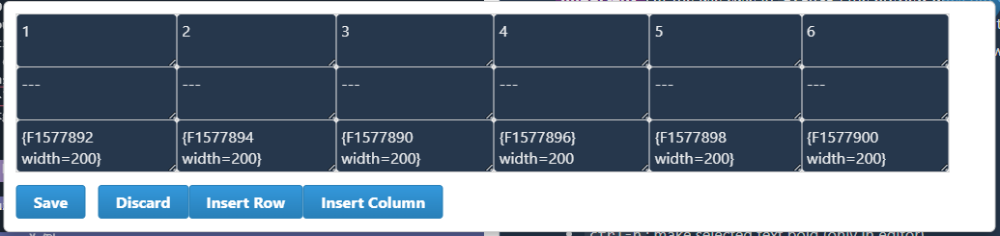

# Phabricator Remarkup Editor Plugin

A bookmarklet injected into Phabricator Remarkup pages, providing full-screen editing, live preview, AutoMerge (three-way merge), and a side minimap for navigation.

## Security
- No additional packages required.
- Only injects CSS and JavaScript into the current page; removed on page refresh.
- No data is collected or sent to any server.

## Usage
- **!! Important !!** Currently supports `Task Maniphest`, `Events`, `Comment Editor`, and `New Comment` only.
- **!! Important !!** For `New Comment`, you must type some text in the editor to show the preview panel before using full-screen editing mode.

## Version
- Current version: `v2.2`

## v2.2 Changes
- AutoMerge now preserves Event invitees/attendees fields on submit.
- Event preview refresh is now aligned with task behavior and keeps scroll alignment after render completion.
- Native editing behavior is preserved better in textarea contexts, including table editor interaction.
- Table editor supports `Tab` / `Shift-Tab` cell navigation.
- Added floating `!!` highlight toggle button with table-aware behavior and overlap avoidance with table editor button.
- Fixed style block structure regression affecting minimap/highlight button CSS application.

## Features

### Toolbar
- A fixed top toolbar with Logo, Edit Mode, Half/Full toggle, Find, Save, and Cancel buttons.
- **Save button** is automatically disabled when no changes have been made; enabled once content is modified.
- The page **does not auto-enter edit mode** on load; you must click Edit Mode manually.
- Pressing Back from comment edit mode restores the preview page and scroll position.

### Editor
- Full-screen / half-screen mode toggle
- **Adjustable split pane** — drag the divider between editor and preview to resize (15%–85%)
- **Scroll sync** — editor and preview scroll positions are synchronized
- **Syntax highlight backdrop** — headings, bold, lists, brackets, and other Remarkup syntax are highlighted with color blocks in the editor
- Hotkeys:
    - `Ctrl-B`: Bold
    - `Ctrl-I`: Italic
    - `Ctrl-S`: Save (triggers AutoMerge)
    - `Ctrl-F`: Open find panel
    - `` ` ``: Code block
    - `Tab` / `Shift-Tab`: Increase / decrease indentation (2 spaces)
    - Auto-pair for brackets: `(`, `[`, `{`, `` ` ``, `"`, `'`
- Find and replace:
    - Case sensitive / insensitive
    - Match whole word
    - Replace one / all
- Table Editor
    - Select table text, then click the Table Editor button to open a GUI editing window
    - Supports Insert Row / Insert Column
    - 
- Auto-indentation on line break
- HTML table paste — paste an HTML table from clipboard and it is automatically converted to Remarkup table format
- Clone button — create a clone from an existing Task or Event

### AutoMerge (Three-Way Merge)
- On save, the plugin fetches the latest version from the server and performs a **three-way merge** (base vs. your changes vs. remote changes).
- **Whitespace-only differences** are automatically resolved.
- If there are no conflicts, the merged result is saved directly.
- If conflicts exist, a **VS Code–style conflict resolution UI** is shown:
    - Accept Current (your changes), Incoming (remote changes), or Both for each conflict
    - Batch resolve with All Current, All Incoming, or All Both
    - Review the selected resolution before saving

### Minimap / Table of Contents
- A vertical **minimap** is displayed on the right side of the screen.
- **Page mode** (non-edit mode): shows headings (h1–h6) from the description and comments with actual content from the timeline.
- **Edit mode**: shows all headings (h1–h6) from the preview pane.
- Hover over a minimap item to see a **tooltip** (first line of content, truncated at 20 characters with "…").
- Click a minimap item to **smooth-scroll** to the corresponding position.
- The **current scroll position** highlights the corresponding minimap item.
- Right-click any minimap item to **toggle a red mark**, useful for flagging important sections.
- Up/Down arrows for quick scroll-to-top / scroll-to-bottom.

### Theme
- Automatically detects page background luminance and switches between light / dark themes.

### Comment Block ID
- Displays a block ID next to each timeline comment (e.g. `T1234#12345`). Click to copy to clipboard.

## Install (Windows One-Click)

Use `install-phab-editor.bat` for automatic installation on Windows.

1. Download this repository (or at least `install-phab-editor.bat`).
2. Double-click `install-phab-editor.bat`.
3. Choose target browser:
    - Chrome
    - Edge
    - Firefox
    - All
4. Wait until installation completes, then re-open browser if needed.
5. Open Phabricator and click the installed bookmark `✏Phab Editor v2.2`.

Notes:
- The installer may close and re-open your browser to update bookmarks safely.
- If Python is missing, auto-install for some browsers may be skipped.

## Install as Bookmark (Manual)

1. Download the latest `plugin-inline.js` from the [latest build artifact](https://nightly.link/sciyen/Phabricator-Editor-Plugin/workflows/python-app.yml/main/plugin-inline.js.zip).
2. Make the bookmarks bar visible in your browser. In Chrome: click the three-dot menu → Bookmarks → Show bookmarks bar.
3. Right-click on the bookmarks bar → Add page. Paste the content of `plugin-inline.js` into the URL field.
4. Done! Click the bookmark to activate the plugin.

## File Structure
| File | Description |
|------|-------------|
| `plugin.js` | Source code (readable) |
| `plugin-inline.js` | Minified bookmarklet (auto-generated by CI, not committed) |
| `install-phab-editor.bat` | Windows one-click installer for Chrome/Edge/Firefox bookmarks |
| `convert.py` | Build script: minifies `plugin.js` with [terser](https://terser.org/) and wraps as bookmarklet |
| `assets/` | Static assets (screenshots, etc.) |

## Development
1. Ensure **Python 3** and **Node.js** are installed.
2. Edit `plugin.js`.
3. Run the conversion script to generate the bookmarklet:
    ```bash
    python3 convert.py
    ```
4. Paste the content of `plugin-inline.js` into a bookmark URL field to test.